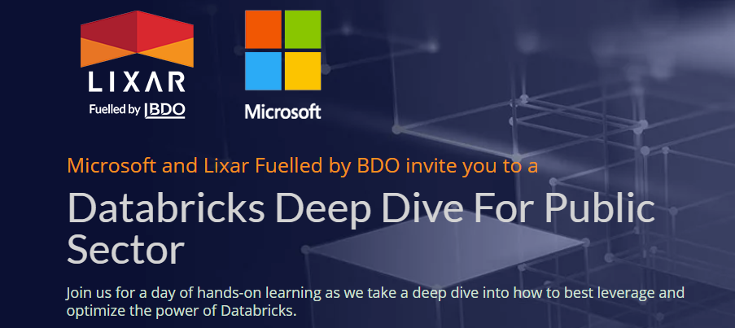

<p align="center">
    
</p>

# Databricks Deep Dive for the Public Sector
## Presented by: Microsoft and Lixar Fuelled by BDO

Date: May 27, 2021 

## Introduction

In this workshop, you will learn how Databricks integrates with the Azure cloud ecosystem to implement modern-day analytics, and scalable machine learning solutions. 

There will be a mix of theory (found in the **slides** folder), and hands-on exercises building up to a fraud detection machine learning application. The instructions to complete the exercises are below.

Note: Steps 5-7 regarding the Storage Account and Key Vault are not required to complete the notebooks, and are labeled as optional. However, it is strongly recommended to follow along since these steps are essential in all Databricks production settings.  

## Instructions

1. Access Azure resources: [Setup01.md](Setup01.md)
2. Create Databricks Cluster, and import notebooks to your Databricks workspace: [Setup02.md](Setup02.md)
3. Complete the notebook: **01_Course_Intro** (from within your Databricks workspace)
4. Complete the notebook: **02_Basic_Notebook** (from within your Databricks workspace)
5. (Optional) Place Storage Account Credentials into the Key Vault: [Setup03.md](Setup03.md)
6. (Optional) Create Databricks Secret Scope: [Setup04.md](Setup04.md)
7. (Optional) Complete the notebook: **03_Secrets_And_Azure_Storage** (from within your Databricks workspace)
8. Complete the notebook: **04_Delta_Tables** (from within your Databricks workspace)
9. Complete the notebook: **05_Machine_Learning_Overview** (from within your Databricks workspace)
10. Complete the notebook: **06_Feature_Scaling_And_Pipelines** (from within your Databricks workspace)
11. Complete the notebook: **07_ML_Flow** (from within your Databricks workspace)
12. Complete the notebook: **08_Classification_Fraud_Detection** (from within your Databricks workspace)

## Bonus Notebooks
Within the Databricks workspace, there is an **Extra** folder alongside the main exercise notebooks. These are concepts frequently important for Databricks in production, but we didn't have enough time to cover today.    

```
├── Extras
	├── 01_Update_Delta_Tables  # Handle data updates: new data, and fill-in missing data  
	├── 02_Azure_Data_Factory   # Simple exercise showing how ADF can pass parameters to the next stage of a data pipeline  
	├── 03_SQL_Database  	    # Write the cleaned Delta Tables to a SQL Database, and run an analytical query
	├── 04_Koalas_API_Pandas    # Brief demo showing the Koalas API for using a Pandas DF in Spark
```

