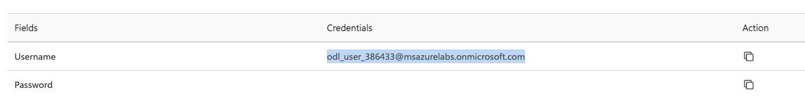
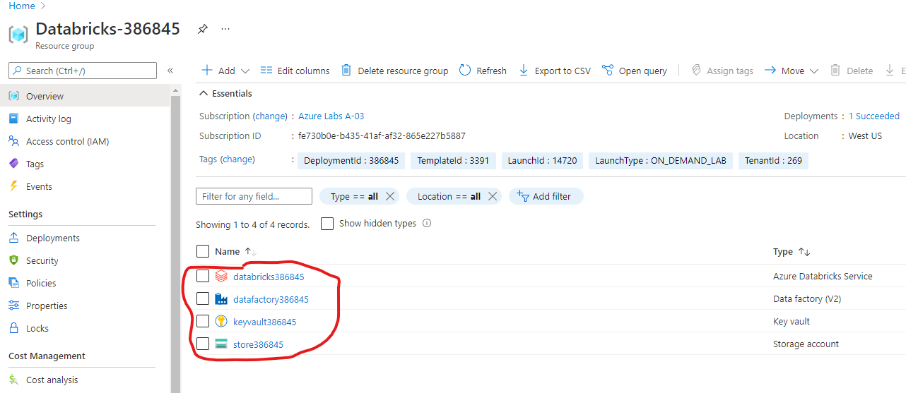

## Setup Task 1 - Access your provided Azure resources:

 1. Go to the link in your email. Fill out your name, organization name, country and the Activation Code from the email.  

 
  

2. Wait for the spin up. Copy the username and password. Username may look something like:  

 
  

3. Go to the Azure Portal: https://portal.azure.com/  

4. Paste the username you were given from the email:

 
  

 And on the next screen, paste the password you received in the email

**Now we are in the Azure Portal!** 

5. Click Resource Groups, and you will see the following resources have been created for you:

 
  

 **DataBricks, Data Factory, Key Vault, and Storage Account.**