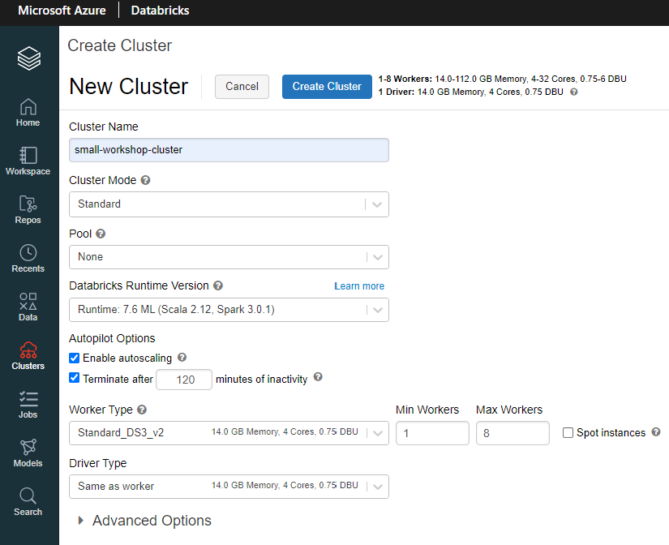

## Setup Task 1 - Create Databricks Cluster, and import the notebooks into the Databricks workspace:

1. From within your Resource Group, click on the Azure Databricks resource

 
  

2. Click Launch Workspace to access the Databricks Workspace

3. Click the Clusters icon on the far left, then **+ Create Cluster**

 
  

4. Configure the cluster with the same options as shown below:

 
  

5. Click **Create Cluster.** It will take a few minutes to spin up.

### While we wait, let's import the notebooks:

1. In this GitHub repo, go to [databricks-notebooks/lixar-databricks-workshop.dbc](databricks-notebooks/lixar-databricks-workshop.dbc), and click **Download**

2. Save the DBC archive to your computer

3. Go back to your Databricks tab, and click the **Workspace** icon

 
  

4. Right click on **Shared,** and select **Import**

 
  

5. Browse to the DBC archive you just downloaded, and click **Import**

6. The notebook files should now all appear within the Shared directory:

 
  

 - If you see the notebooks, then you are ready to begin the exercises!