## Setup Task 0 - Log into the Azure Portal

 1. Go to the Azure Portal https://portal.azure.com/ 

 2. If already logged in skip to Task 1  
    Otherwise, paste the username you were given from the email

 
 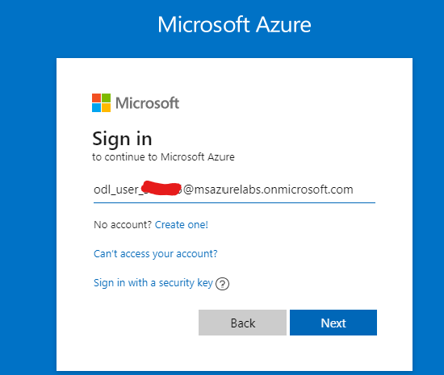 

 And on the next screen, paste the password you received in the email

## Setup Task 1 - Add Access Policy to Key Vault

 1. Select Resource Groups and select the only resource group

 
 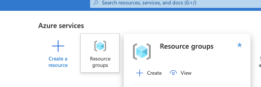 

 2. Select your Key Vault 
  
 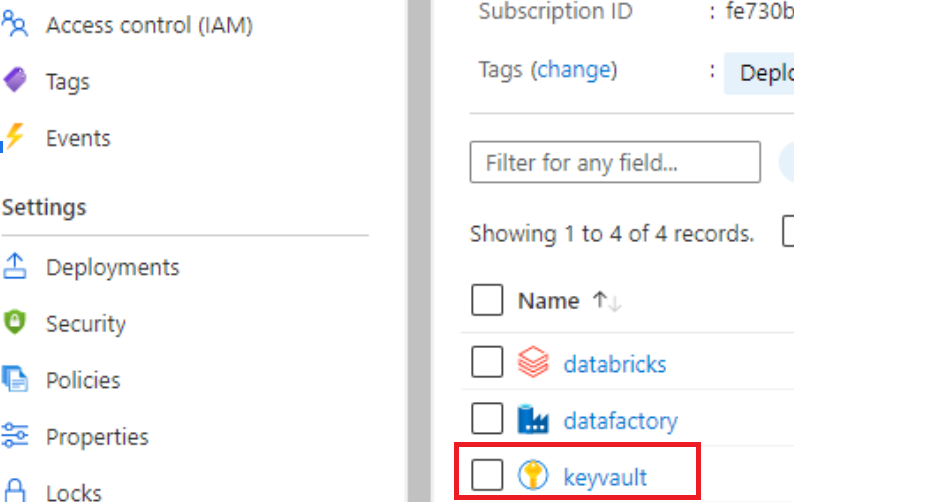 

 3. Select Access Policies

 
 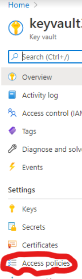 

 5. Select “Add Access Policy”
 
 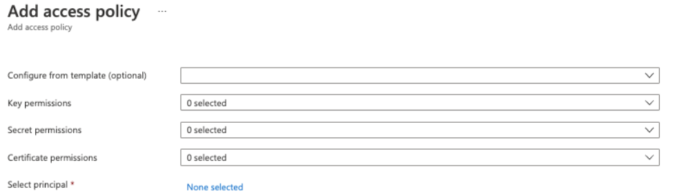 

 3. Select Principal → Select none selected.  
 Type (or copy from your email) and select the username which you logged into the azure portal with, similar to this account below  
odl_user_XXXXXX@msazurelabs.onmicrosoft.com  
You will see a different user name than yours throughout this document, but yours will remain the same.

 
 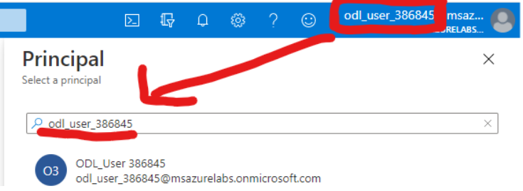 

 4. Select the Select button
 
  

 5. Select Configure from template “Key, Secret, & Certificate Management” and select Add. <b>Ensure to Save in the next step prior to navigating away</b>

 
 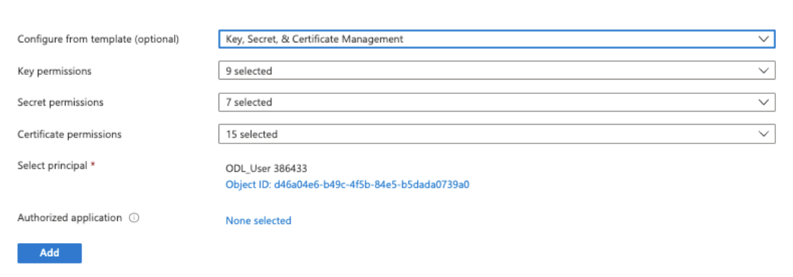 

 6. <b>Select Save to save your new access policy</b>
 
 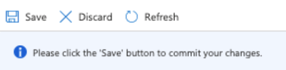 

 7. Go back to your Resource by by selecting Overview in your Key Vault
 
 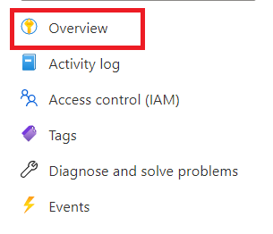 

 8. Then select your specific resource group
 
 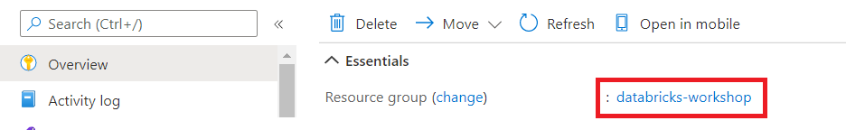 

## Setup Task 2 - Create Container

 1. Select your storage account
 
 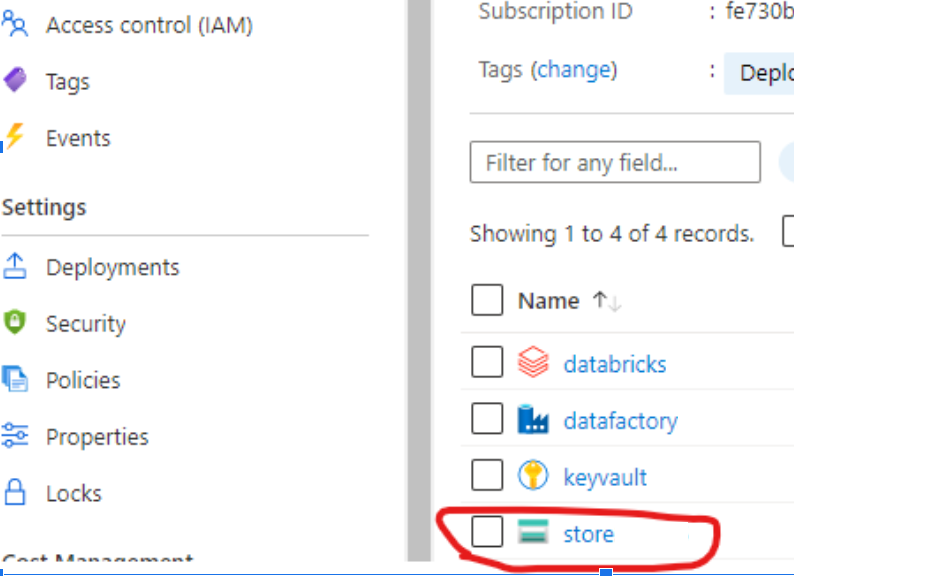 

 2. Select containers
 
 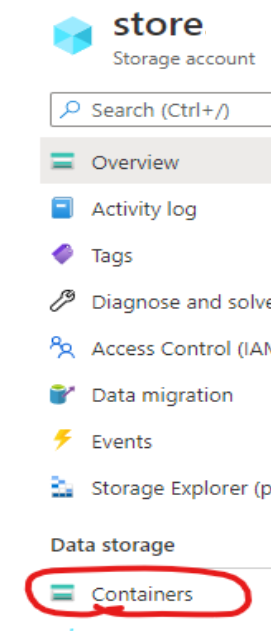 

 5. Select “+ Containers”, and name the container exactly as below 
databricks-workshop
 
 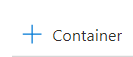 

 6. Select create
 
 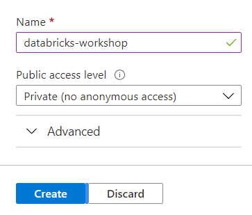 

## Setup Task 3 - Copy Storage Account Secret
 1. Within the storage account select Access keys
 
 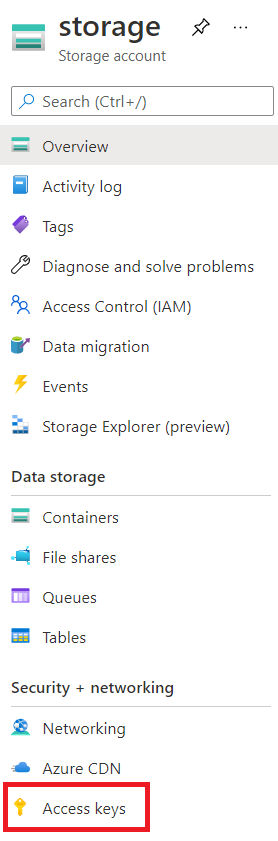 

 2. Select Show Keys
 
 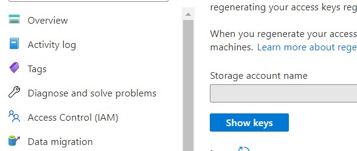 

 3. Select the copy button to the far right of the first key, for this screen this key has been obfuscated and your key will show fully. 
 
 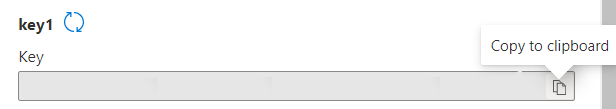 

 4. Select Overview in your Storage Account and select your specific resource group
 
 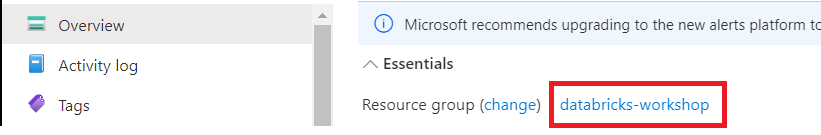 

## Setup Task 4 - Add Storage Account Secret
 1. Select your Key Vault 
  
  

 2. Within the Key Vault, Select Secrets (not keys)
 
 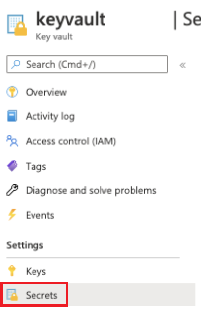 

 3. Then Generate and Import
 
 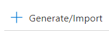 

 4. For the value, paste in the copied key from the storage account in the value textbox.  
 NOTE: if it does not successfully paste, go back to the other tab (Storage Account Access Keys), copy the key1 value again, go back to the Key Vault Secrets tab, and paste the Value again.
 
 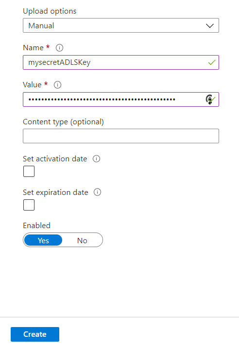 

 5. For name put the following exactly (no spaces)  
 mysecretADLSKey
 
  

 6. Then select create
  
  

 7. **IMPORTANT:** Keep this tab open, because we will need to use the Key Vault during the next task.

## This task was a bit involved but grants the following advantages:
- **Data Security:** The Azure Key Vault is a secure place to store the access credentials to our storage account, so outsiders cannot access our data.
- **Allow Databricks Access to Data**: Next, we will create a secure connection between DataBricks and the Key Vault (using a DataBricks Secret Scope). This will allow Databricks to access the Storage Account, where we will be writing our Delta Tables to.