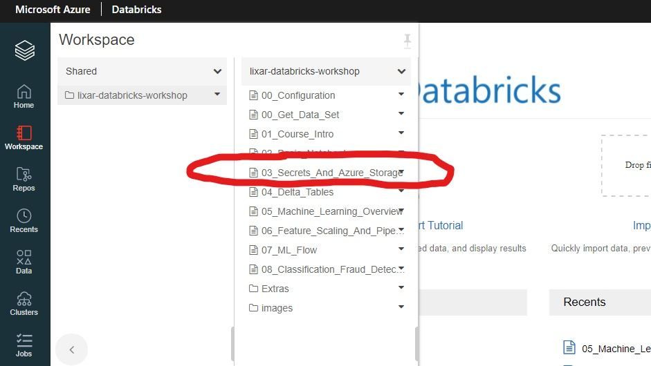
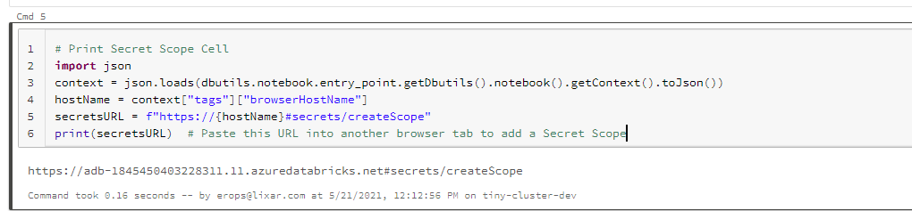
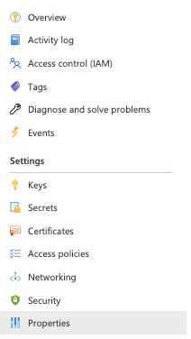
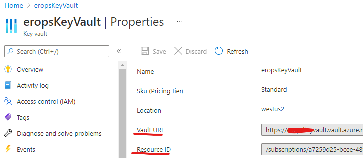
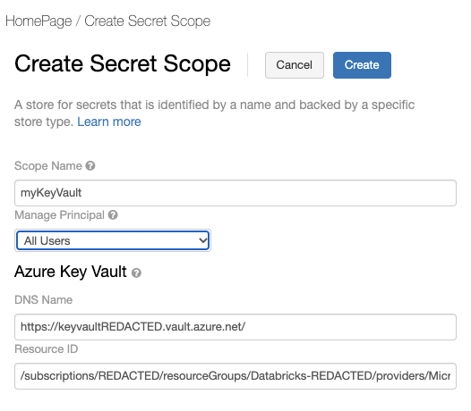

## Setup Task 1 - Create DataBricks Secret Scope:
### This will connect Databricks to the credentials stored in the Key Vault, allowing Databricks access to the Azure Storage Account to read and write data. 

1. Open the Databricks notebook: **03_Secrets_And_Azure_Storage**  

 
  

2. Run the first cell containing code:  

 
  

 - Copy the URL that is returned

3. Open a new tab in your browser, and paste in the URL. This will take you to a page titled "Create Secret Scope"

4. Go back to your other tab from the previous task with the Azure Key Vault
- **OR** if you lost the tab: Go to the Azure Portal https://portal.azure.com/, then your Key Vault under *Recent resources*

5. From within the Key Vault, click *Properties*: 

 
  

6. In this screen (shown below), copy the “Vault URI” from the Key Vault into the “DNS Name” on the Create Secret Scope tab:
 
 
  

7. Likewise, copy the "Resource ID” from the Key Vault into the “Resource ID” on the Create Secret Scope tab.
 - The final Secret Scope form should look like the image below (though the DNS name and Resource ID will be slightly different):

 
  

8. **IMPORTANT:** Make sure the *Scope Name* is exactly: **myKeyVault**
 - *Manage Principal* must also be set to **All Users**

9. We'll end the Scope creation by clicking *Create*:

 
  

### That is it, we are now able to call secret values from the Azure Key Vault into Databricks!